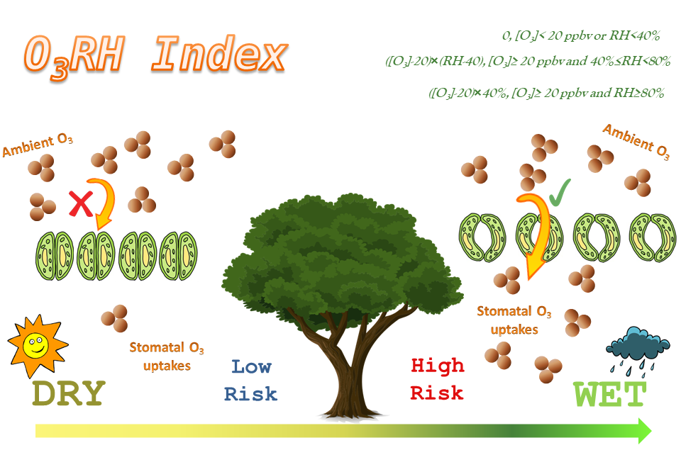
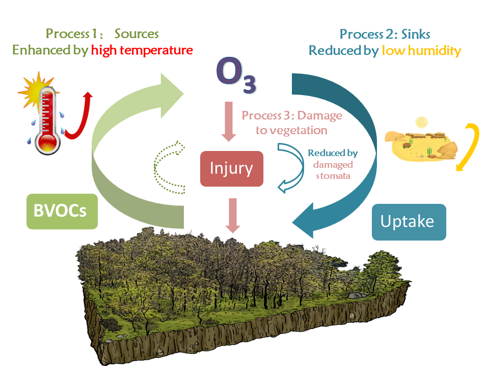

Ground-level ozone and vegetation have complex interactions. On the on hand, vegetation acts as both of the sources (BVOCs emissions) and sinks (stomatal dry deposition) for ozone; On the other hand, ozone exposure would lead to detrimental effects on vegetation and suppress plant growth. 

In this project, we firstly used a processed-based dynamic global vegetation model (YIBs) to quantified the ozone-induced GPP reduction over China, the U.S. and Europe. By examining the relationships between GPP damages and meteorological factors,  we proposed a new humidity-based index O3RH to represent the ozone vegetation damages. The new index is not only able to be calculated as easy as exposure-based indices(not dependent on any expensive observations or numerical models) and has similar spatiotemporal representation of ozone damage as dose-based method.Applications of O3RH index show the decline of ozone concentrations over the past several decades cannot relieve ozone vegetation damages in eastern U.S and westernEurope. Meanwhile, the fast increases of surface ozone concentrations boost damages to vegetation in China.

Then with the help of two coupling models (ModelE2-YIBs and GC-YIBs model), we examined the feedbacks of ozone-vegetation interactions on global ozone concentrations as well as the ozone pollution episodes in eastern China. The ModelE2-YIBs simulations showed  ozone-induced inhibition of stomatal conductance on average increases surface ozone by +2.1 (+1.4) ppbv in eastern China, +1.6 (-0.5) ppbv in eastern U.S., and +1.3 (+1.0) ppbv in western Europe for high (low) damaging sensitivity，which is dominated by reduced ozone dry deposition. The GC-YIBs results quantify the contributions of changes in BVOCs emissions and stomatal dry deposition to the ozone enhancements during OPEs over May to October of 2014-2017 in North China and Yangtze River Delta. Compared to seasonal mean, about 8.4% and 22.9% of O3 enhancements during OPEs are caused by these two vegetation-related processes in North China and Yangtze River Delta, respectively.

